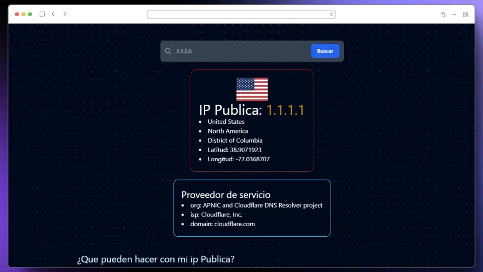

# IpInfo

## Descripción

IpInfo es una herramienta que te permite obtener información detallada sobre direcciones IP públicas. Además, al iniciar, muestra la IP pública de tu conexión.

## Instalación

1. Clona este repositorio: `git clone https://github.com/NelsonNV/IpInfo.git`
2. Navega al directorio del proyecto: `cd IpInfo`
3. Instala las dependencias: `npm install`

## Licencia

Este proyecto está bajo la Licencia MIT. Ver el archivo [LICENSE](LICENSE) para más detalles.
